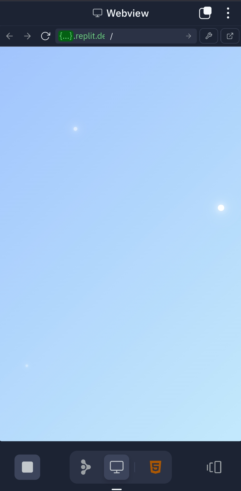
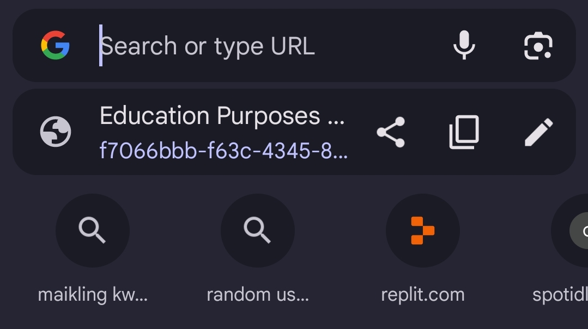

---

# 📝 AdSense Tutorial  
**By Jr Busaco**  
  

Welcome to my **AdSense Tutorial**! This guide will walk you through the simple steps to set up Google AdSense on your website and start earning money. Whether you're a beginner or just need a refresher, this tutorial is for you.  

---

## 🛠️ What You’ll Need  
Before we start, make sure you have the following:  
1. **A Simple Website**: Your website should be live and accessible online.  
2. **An AdSense Account**: Sign up for free at [Google AdSense](https://www.google.com/adsense/start/).  
3. **Basic HTML/CSS Knowledge**: You’ll need this to add code to your website.  

---

## 🚀 Step-by-Step Guide  

### Step 1: Create and Deploy Your Website  
- Build a simple website using HTML, CSS, and JavaScript.  
- Deploy your website using a hosting platform like **[Vercel](https://vercel.com/)** (it’s free and easy to use!).  
- Copy the link (URL) of your website.  
  
      

---

### Step 2: Add Your Website to AdSense  
1. Go to your AdSense account.  
2. Click **Add Site**.  
3. Paste your website URL and click **Save**.  
    

---

### Step 3: Fill in Payment Information  
- Complete the payment details in your AdSense account. This is where Google will send your earnings.  
    

---

### Step 4: Connect Your Site to AdSense  
1. Go to the **Connect your site to AdSense** section.  
2. Click **Let’s Go**.  
    

---

### Step 5: Copy the AdSense Code  
- Copy the **AdSense code snippet** and the **ads.txt snippet**.  
    
    

---

### Step 6: Add the Code to Your Website  
1. Open your website’s **public folder** and find the `index.html` file.  
2. Paste the AdSense code between the `<head></head>` tags on every page of your site.  
    

---

### Step 7: Add the ads.txt File  
1. If you don’t have an `ads.txt` file, create one.  
2. Paste the `ads.txt` snippet into the file.  
3. Upload the `ads.txt` file to your website’s **root directory** (public folder).  
    

---

### Step 8: Verify the Code  
1. Go back to your AdSense account.  
2. Check the box that says **I’ve placed the code**.  
3. Click **Verify**.  
    

---

### Step 9: Request a Review  
1. In the **Request Review** section, click the **Request Review** button.  
2. Google will review your website to ensure it meets their policies.  
    

---

## ⏳ How Long Does It Take?  
- **AdSense Approval**: It usually takes **1-2 weeks** for Google to review and approve your website.  
- **Ad Display**: Once approved, ads will start showing on your site immediately.  

---

## 🌟 Recommended Hosting: Vercel  
If you don’t have a hosting platform yet, I recommend using **[Vercel](https://vercel.com/)**. It’s:  
- **Free** for small projects.  
- **Easy to use** with a simple drag-and-drop interface.  
- **Fast** for deploying websites.  

---

## 💡 Tips for Success  
1. **Use High-Quality Content**: Make sure your website has original and useful content.  
2. **Follow AdSense Policies**: Avoid prohibited content like adult material or copyrighted content.  
3. **Experiment with Ad Placements**: Try different ad locations to see what works best.  

---

## � Done!  
Once your website is approved, ads will start showing, and you’ll begin earning money!  

---

## 📞 Contact Me  
If you have any questions or need help, feel free to reach out:  
- **Facebook**: [Jr Busaco](https://www.facebook.com/jr.busaco.271915)  

---

## 📜 License  
This project is licensed under the **MIT License**. See the [LICENSE](LICENSE) file for details.  

---

Thank you for using this tutorial! If you found it helpful, please give it a ⭐ on GitHub. Happy earning! 🚀  

---
